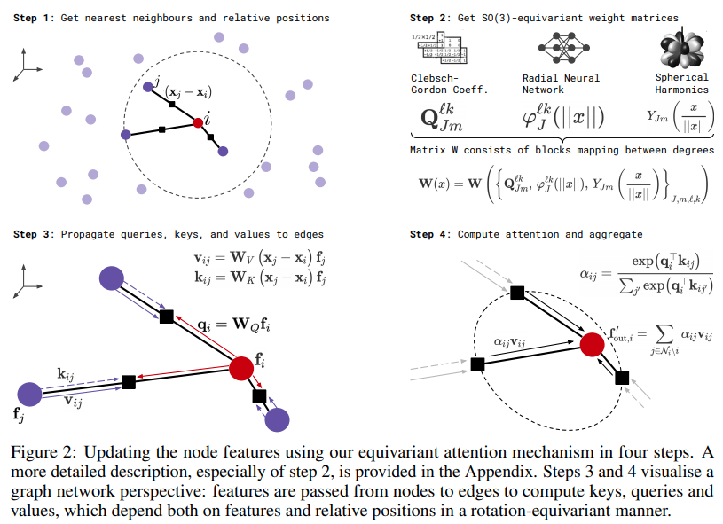

</img>

## SE3 Transformer - Pytorch

Implementation of <a href="https://arxiv.org/abs/2006.10503">SE3-Transformers</a> for Equivariant Self-Attention, in Pytorch. May be needed for replicating Alphafold2 results and other drug discovery applications.

## Install

```bash
$ pip install se3-transformer-pytorch
```

## Usage

```python
import torch
from se3_transformer_pytorch import SE3Transformer

model = SE3Transformer(
    dim = 512,
    heads = 8,
    depth = 6,
    dim_head = 64,
    num_degrees = 4,
    valid_radius = 10
)

feats = torch.randn(1, 1024, 512)
coors = torch.randn(1, 1024, 3)
mask  = torch.ones(1, 1024).bool()

out = model(feats, coors, mask) # (1, 1024, 512)
```

Potential example usage in Alphafold2, as outlined <a href="https://fabianfuchsml.github.io/alphafold2/">here</a>

```python
import torch
from se3_transformer_pytorch import SE3Transformer

model = SE3Transformer(
    dim = 64,
    depth = 2,
    input_degrees = 1,
    num_degrees = 2,
    output_degrees = 2,
    reduce_dim_out = True
)

atom_feats = torch.randn(2, 32, 64)
coors = torch.randn(2, 32, 3)
mask  = torch.ones(2, 32).bool()

refinement = model(atom_feats, coors, mask, return_type = 1) # (2, 32, 3)
```

You can also let the base transformer class take care of embedding the type 0 features being passed in. Assuming they are atoms

```python
import torch
from se3_transformer_pytorch import SE3Transformer

model = SE3Transformer(
    num_tokens = 28,       # 28 unique atoms
    dim = 64,
    depth = 2,
    input_degrees = 1,
    num_degrees = 2,
    output_degrees = 2,
    reduce_dim_out = True
)

atoms = torch.randint(0, 28, (2, 32))
coors = torch.randn(2, 32, 3)
mask  = torch.ones(2, 32).bool()

refinement = model(atoms, coors, mask, return_type = 1) # (2, 32, 3)
```

If you think the net could further benefit from positional encoding, you can featurize your positions in space and pass it in as follows.

```python
import torch
from se3_transformer_pytorch import SE3Transformer

model = SE3Transformer(
    dim = 64,
    depth = 2,
    input_degrees = 2,
    num_degrees = 2,
    output_degrees = 2,
    reduce_dim_out = True  # reduce out the final dimension
)

atom_feats  = torch.randn(2, 32, 64, 1) # b x n x d x type0
coors_feats = torch.randn(2, 32, 64, 3) # b x n x d x type1

# atom features are type 0, predicted coordinates are type 1
features = {'0': atom_feats, '1': coors_feats}
coors = torch.randn(2, 32, 3)
mask  = torch.ones(2, 32).bool()

refinement = model(features, coors, mask, return_type = 1) # (2, 32, 3) - equivariant to input type 1 features and coordinates
```

## Edges

To offer edge information to SE3 Transformers (say bond types between atoms), you just have to pass in two more keyword arguments on initialization.

```python
import torch
from se3_transformer_pytorch import SE3Transformer

model = SE3Transformer(
    num_tokens = 28,
    dim = 64,
    num_edge_tokens = 4,       # number of edge type, say 4 bond types
    edge_dim = 16,             # dimension of edge embedding
    depth = 2,
    input_degrees = 1,
    num_degrees = 3,
    output_degrees = 1,
    reduce_dim_out = True
)

atoms = torch.randint(0, 28, (2, 32))
bonds = torch.randint(0, 4, (2, 32, 32))
coors = torch.randn(2, 32, 3)
mask  = torch.ones(2, 32).bool()

pred = model(atoms, coors, mask, edges = bonds, return_type = 0) # (2, 32, 1)
```

## Caching

By default, the basis vectors are cached. However, if there is ever the need to clear the cache, you simply have to set the environmental flag `CLEAR_CACHE` to some value on initiating the script

```bash
$ CLEAR_CACHE=1 python train.py
```

Or you can try deleting the cache directory, which should exist at

```bash
$ rm -rf ~/.cache.equivariant_attention
```

## Testing

```bash
$ python setup.py pytest
```

## Credit

This library is largely a port of <a href="https://github.com/FabianFuchsML/se3-transformer-public">Fabian's official repository</a>, but without the DGL library.

## Citations

```bibtex
@misc{fuchs2020se3transformers,
    title   = {SE(3)-Transformers: 3D Roto-Translation Equivariant Attention Networks}, 
    author  = {Fabian B. Fuchs and Daniel E. Worrall and Volker Fischer and Max Welling},
    year    = {2020},
    eprint  = {2006.10503},
    archivePrefix = {arXiv},
    primaryClass = {cs.LG}
}
```
